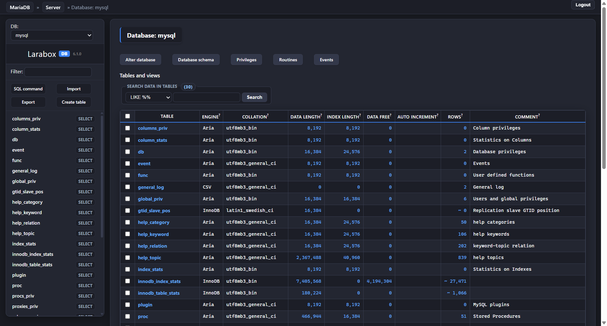

# Larabox — Adminer Dark Theme

A clean, modern dark theme for [Adminer](https://www.adminer.org/) built for the [Larabox](https://larabox.org) desktop app.



## Features

- 🌑 Deep slate dark palette — easy on the eyes
- 🎨 Consistent design tokens via CSS variables (`--larabox-*`)
- 💡 JUSH syntax highlighting — SQL keywords, identifiers, strings, operators all distinctly colored
- 📐 Sidebar table list with inline Select pills
- ✅ Styled alerts, buttons, forms, and pagination
- 🔲 Schema diagram with visible table boxes and readable text
- Works with **Adminer 4.x, 5.x, and 6.x**

## Installation

1. Download [`adminer.css`](adminer.css)
2. Place it in the **same folder** as your `adminer.php` file:

```
your-server/
├── adminer.php
└── adminer.css   ← drop it here
```

3. Reload Adminer — the theme applies automatically.

## Color Palette

| Token | Value | Usage |
|---|---|---|
| `--larabox-page` | `#191b22` | Body background |
| `--larabox-surface` | `#232631` | Cards / components |
| `--larabox-fg` | `#f8fafc` | Primary text |
| `--larabox-muted` | `#94a3b8` | Secondary text |
| `--larabox-accent` | `#3b82f6` | Buttons / active states |
| `--larabox-link` | `#60a5fa` | Links |
| `--larabox-border` | `#383d4f` | Borders |

## Built With

This theme was developed as part of [Larabox](https://larabox.org) — a local PHP/Laravel development environment.

## License

MIT
